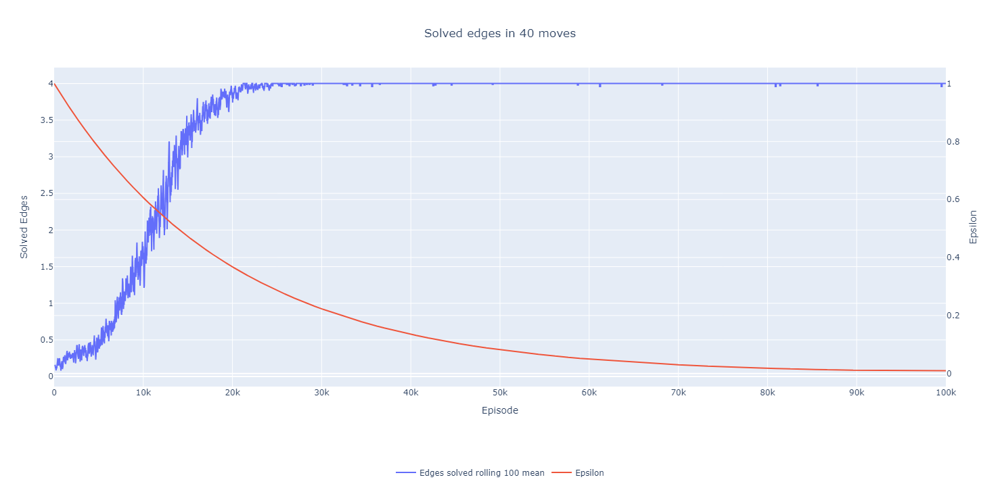

# Agent for the 4 edges of the first layer

Why do we have a version 3?

Because last version used to blackout all the corners but none of the edges.

## Setup

* Blackout now affects everything except for the centers and the edges of the first layer (last time it did not affect the other edges)
* Net
```python
size = 256
nn.Sequential(
    nn.Linear(state_size, size),
    nn.ReLU(),
    nn.Linear(size, size),
    nn.LeakyReLU(),
    nn.Linear(size, action_size)
)
```
* Reward scheme
    * 50 for solving all 4 edges
    * 10 for each solved edge
    * -10 for each unsolved edge
    * -0.2 for a move not affecting if the edges are solved or not
* Hyperparameters
```python
num_episodes = 100_000
max_steps = 40
gamma = 0.99
epsilon_start = 1
epsilon_end = 0.01
epsilon_decay = 0.99995
learning_rate = 0.00025
batch_size = 64
buffer_capacity = 10_000
target_update_interval = 10
```

## Results from training





## Results from inference


