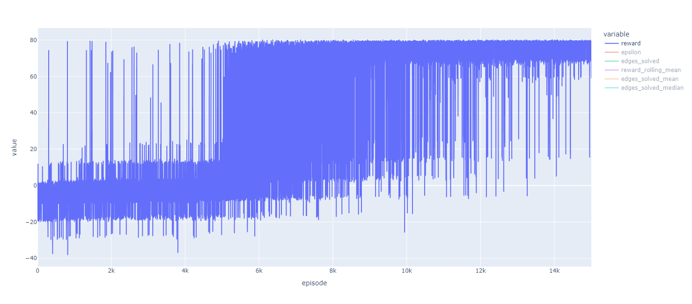
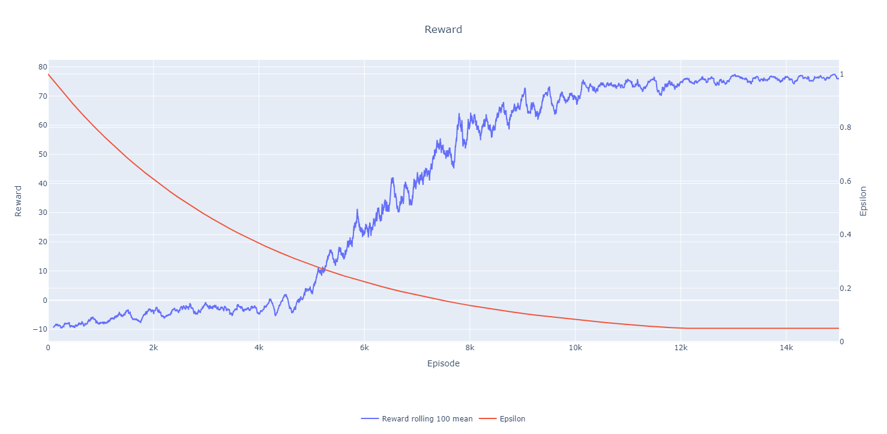
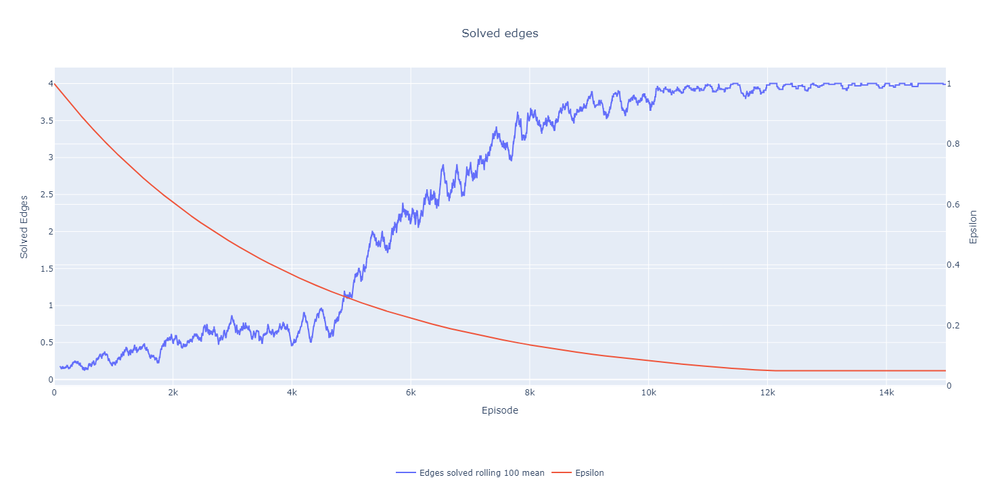
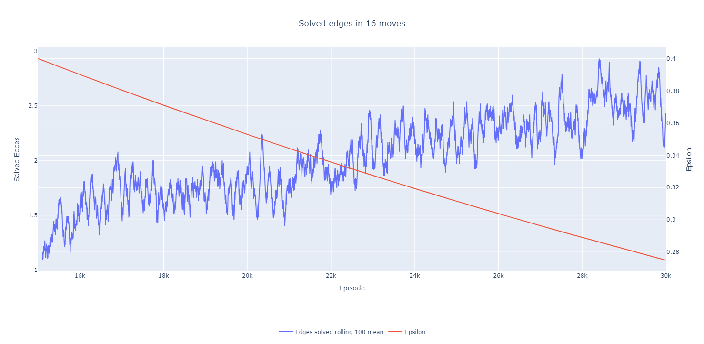
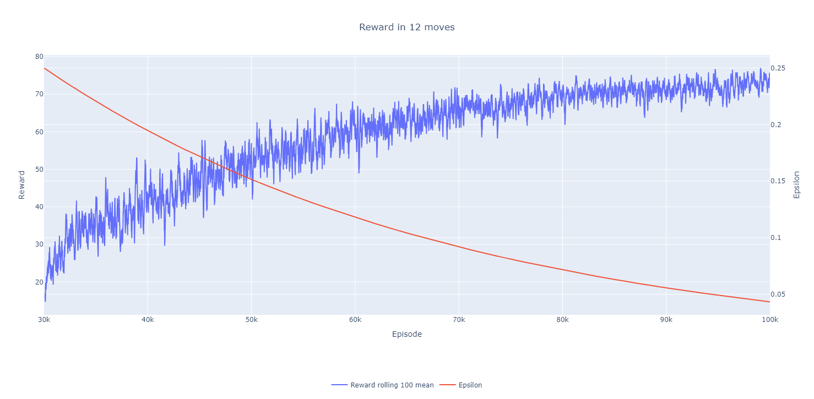
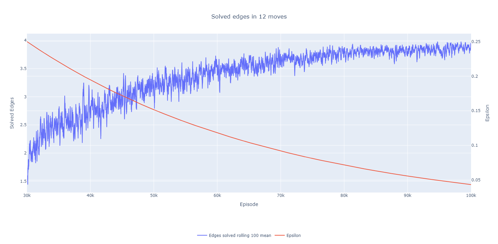
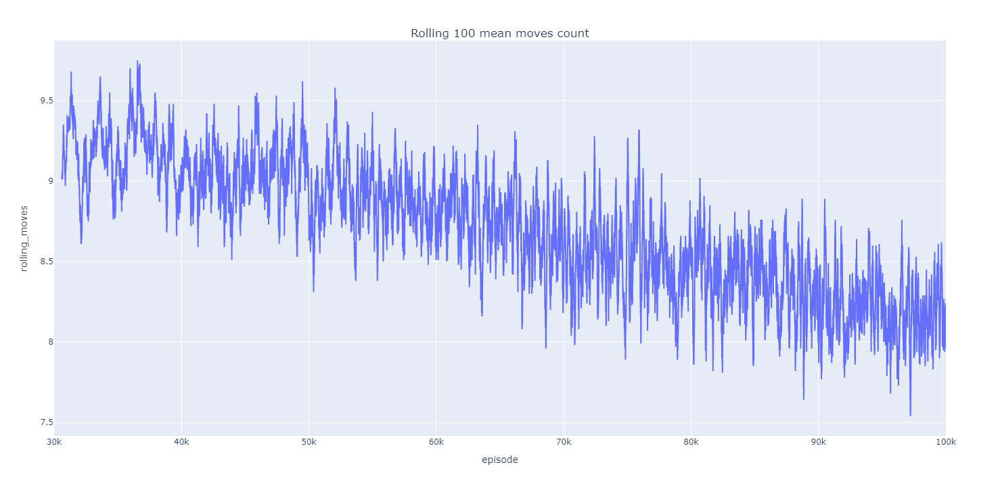
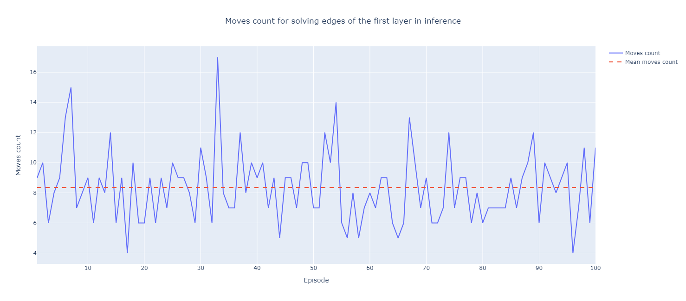

# Agent for the 4 edges of the first layer

## Improvements from last time

* Changed `_get_obs` in the cube enviornment to have all the corners as value 6 (Unknown). This way the agent is more concious about the progress of the edges in particular
* Manually set to `-inf` the values of the illegal actions in the `q_values`
* Changed the net of the agent a bit

Old:
```python
size = 256
self.net = nn.Sequential(
    nn.Linear(state_size, size),
    nn.ReLU(),
    nn.Linear(size, size),
    nn.ReLU(),
    nn.Linear(size, action_size)
)
```

New:

```python
size = 256
self.net = nn.Sequential(
    nn.Linear(state_size, size),
    nn.ReLU(),
    nn.Linear(size, size),
    nn.LeakyReLU(),
    nn.Linear(size, action_size)
)
```

* Changed the reward scheme a little but maintained the general idea
    * 50 for solving all 4 edges
    * 10 for each solved edge
    * -10 for each unsolved edge
    * -0.2 for a move not affecting if the edges are solved or not

## Hyperparameters

```python
num_episodes = 15_000
max_steps = 50
gamma = 0.99
epsilon_start = 1
epsilon_end = 0.05
epsilon_decay = 0.99975
learning_rate = 0.00025
batch_size = 64
buffer_capacity = 10_000
target_update_interval = 10
```

## Results from first train

* from 1 to 15_000 episode
* `max_steps = 40`





## Results from second train

* from 15_001 to 30_000 episode
* `max_steps = 16`



## Results from third train

* from 30_001 to 100_000 episode
* `max_steps = 12`





# Inference

